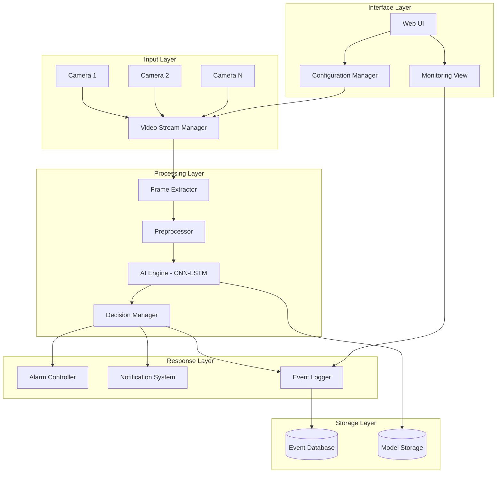

# Design Document: Violence Detection Camera System

## Overview

The Violence Detection Camera System is a real-time AI-powered surveillance solution that uses LSTM neural networks to detect violent behavior in video feeds and trigger immediate alarm responses. The system employs a hybrid CNN-LSTM architecture where CNNs extract spatial features from video frames and LSTMs analyze temporal sequences to identify violent patterns with high accuracy and minimal false positives.

The system architecture follows a modular design with clear separation between video processing, AI inference, alarm management, and user interface components. This enables scalable deployment across multiple cameras while maintaining real-time performance requirements for 24/7 surveillance operations.

## Architecture

The system follows a distributed microservices architecture with the following high-level components:



### Component Interaction Flow

1. **Video Ingestion**: Multiple camera feeds are managed by the Video Stream Manager using RTSP protocol
2. **Frame Processing**: Frame Extractor samples video at 15 FPS and Preprocessor normalizes frames to 128x128 pixels
3. **AI Analysis**: CNN-LSTM model processes 30-frame temporal windows to detect violent behavior
4. **Decision Making**: Decision Manager evaluates confidence scores and triggers appropriate responses
5. **Response Execution**: Alarm Controller activates alarms while Notification System sends alerts
6. **Monitoring**: Web UI provides real-time monitoring and configuration capabilities

## Components and Interfaces

### Video Stream Manager
**Responsibility**: Manages multiple camera connections and video stream distribution

**Key Interfaces**:
- `addCamera(cameraConfig: CameraConfig): CameraId`
- `removeCamera(cameraId: CameraId): boolean`
- `getStreamStatus(cameraId: CameraId): StreamStatus`
- `subscribeToStream(cameraId: CameraId, callback: FrameCallback): Subscription`

**Implementation Details**:
- Supports up to 16 simultaneous RTSP camera connections
- Implements connection pooling and automatic reconnection
- Provides frame buffering to handle network latency variations
- Maintains camera priority levels for resource allocation

### AI Engine (CNN-LSTM)
**Responsibility**: Performs violence detection using deep learning models

**Key Interfaces**:
- `analyzeFrameSequence(frames: Frame[], cameraId: CameraId): DetectionResult`
- `updateSensitivity(level: SensitivityLevel): void`
- `getModelMetrics(): ModelMetrics`
- `loadModel(modelPath: string): boolean`

**Architecture Details**:
- **CNN Component**: ResNet50-based feature extractor for spatial analysis
- **LSTM Component**: Bidirectional LSTM with 256 hidden units for temporal analysis
- **Attention Mechanism**: Multi-head self-attention layer for focusing on relevant features
- **Input Processing**: 30-frame sequences at 128x128 resolution
- **Output**: Confidence score (0-1) with violence classification

**Model Pipeline**:


### Decision Manager
**Responsibility**: Evaluates AI predictions and makes alarm decisions

**Key Interfaces**:
- `processDetection(result: DetectionResult): AlarmDecision`
- `updateThresholds(config: ThresholdConfig): void`
- `getDecisionHistory(timeRange: TimeRange): DecisionHistory[]`

**Decision Logic**:
- Confidence threshold: 0.90 for alarm triggering
- Temporal smoothing: Requires 3 consecutive positive detections
- False positive suppression: Maintains pattern database for common false triggers
- Severity classification: Maps confidence scores to alarm priority levels

### Alarm Controller
**Responsibility**: Manages alarm states and output devices

**Key Interfaces**:
- `triggerAlarm(severity: AlarmSeverity, cameraId: CameraId): AlarmId`
- `acknowledgeAlarm(alarmId: AlarmId, userId: UserId): boolean`
- `configureOutputs(outputs: AlarmOutput[]): void`
- `getActiveAlarms(): ActiveAlarm[]`

**Alarm Types**:
- Audio alarms with configurable volume and patterns
- Visual indicators (strobes, LED panels)
- Digital outputs for integration with existing security systems
- Network notifications to security management platforms

### Notification System
**Responsibility**: Sends alerts via multiple communication channels

**Key Interfaces**:
- `sendNotification(event: ViolenceEvent, channels: NotificationChannel[]): void`
- `configureChannels(config: ChannelConfig[]): void`
- `getDeliveryStatus(notificationId: NotificationId): DeliveryStatus`

**Supported Channels**:
- Email with embedded video snapshots and event details
- SMS with concise alert messages and location information
- Push notifications to mobile applications
- Webhook integrations for third-party systems

## Data Models

### Core Data Structures

```typescript
interface CameraConfig {
  id: CameraId;
  name: string;
  rtspUrl: string;
  location: string;
  priority: number;
  sensitivityLevel: SensitivityLevel;
  enabled: boolean;
}

interface DetectionResult {
  cameraId: CameraId;
  timestamp: Date;
  confidenceScore: number;
  boundingBoxes: BoundingBox[];
  frameSequence: Frame[];
  processingTime: number;
}

interface ViolenceEvent {
  id: EventId;
  cameraId: CameraId;
  timestamp: Date;
  duration: number;
  severity: AlarmSeverity;
  confidenceScore: number;
  videoClip: VideoClip;
  acknowledged: boolean;
  acknowledgedBy?: UserId;
}

interface AlarmDecision {
  shouldTrigger: boolean;
  severity: AlarmSeverity;
  reason: string;
  suppressionRules: string[];
}
```

### Database Schema

**Events Table**:
- Primary key: event_id (UUID)
- Indexed fields: camera_id, timestamp, severity
- Retention: 90 days with automatic archival

**Cameras Table**:
- Primary key: camera_id (UUID)
- Configuration data with versioning support
- Status tracking and health metrics

**Users Table**:
- Authentication and authorization data
- Role-based access control (Administrator, Operator)
- Audit trail for configuration changes

## Correctness Properties

*A property is a characteristic or behavior that should hold true across all valid executions of a system-essentially, a formal statement about what the system should do. Properties serve as the bridge between human-readable specifications and machine-verifiable correctness guarantees.*

Before defining the correctness properties, I need to analyze the acceptance criteria from the requirements to determine which ones are testable as properties.

### Property 1: LSTM Detection Accuracy and Performance
*For any* video sequence containing violent behavior, the AI_Engine should detect it within 2 seconds with at least 95% accuracy and false positive rate below 2%, using temporal windows of at least 30 frames for classification
**Validates: Requirements 1.1, 1.2, 1.3, 1.4**

### Property 2: Alarm Response Reliability
*For any* confirmed violence event with confidence above 90%, the Alarm_Controller should trigger an alarm within 1 second and maintain overall alarm accuracy above 98%
**Validates: Requirements 2.1, 2.2, 2.5**

### Property 3: Sensitivity Configuration Behavior
*For any* sensitivity level setting, the AI_Engine should adjust confidence thresholds appropriately (low sensitivity requires higher confidence, high sensitivity accepts lower confidence) and apply changes within 5 seconds
**Validates: Requirements 3.2, 3.3, 3.4**

### Property 4: Multi-Camera Processing Consistency
*For any* combination of active camera feeds up to 16 cameras, the AI_Engine should maintain consistent detection performance and processing latency across all feeds
**Validates: Requirements 4.2, 4.4**

### Property 5: Fault Tolerance and Recovery
*For any* camera disconnection or hardware failure, the System should continue monitoring remaining cameras, log the failure, and recover within specified time limits (10 seconds for camera addition, 10 seconds for failover)
**Validates: Requirements 4.3, 9.5**

### Property 6: Comprehensive Event Logging
*For any* system event (violence detection, configuration change, alarm state transition), the Event_Logger should record all required information fields with proper timestamps and maintain data for at least 90 days
**Validates: Requirements 5.1, 5.2, 5.3, 5.4**

### Property 7: Notification Delivery Reliability
*For any* violence event, the Notification_System should deliver alerts via all configured channels within 5 seconds, include all required content (details, timestamps, snapshots), and retry failed deliveries up to 3 times with exponential backoff
**Validates: Requirements 6.1, 6.2, 6.3, 6.4, 6.5**

### Property 8: Real-time UI Responsiveness
*For any* violence event or system state change, the UI should immediately update visual indicators, highlight affected cameras, and display current detection status and confidence levels
**Validates: Requirements 7.2, 7.3, 7.4, 7.5**

### Property 9: Configuration Security and Validation
*For any* configuration change attempt, the System should require proper authentication, validate all settings, provide immediate feedback on errors, and log all changes with administrator identity
**Validates: Requirements 8.2, 8.3, 8.4, 8.5**

### Property 10: Performance Under Load
*For any* system load condition, the System should maintain detection latency below 2 seconds, handle memory management without leaks, and preserve detection accuracy during extended operation
**Validates: Requirements 9.2, 9.3, 9.4**

### Property 11: Data Security and Privacy
*For any* data storage or transmission operation, the System should use AES-256 encryption for stored data, TLS 1.3+ for network communications, enforce strong authentication policies, and exclude privacy zones from processing
**Validates: Requirements 10.1, 10.2, 10.3, 10.5**

## Error Handling

### AI Engine Error Handling
- **Model Loading Failures**: Fallback to backup model or safe mode operation
- **Processing Timeouts**: Skip problematic frames and continue with next sequence
- **Memory Exhaustion**: Reduce processing quality gracefully rather than failing
- **Invalid Input Data**: Log errors and continue processing valid streams

### Camera Connection Error Handling
- **Network Timeouts**: Automatic reconnection with exponential backoff
- **Authentication Failures**: Alert administrators and retry with stored credentials
- **Stream Format Issues**: Attempt format conversion or skip problematic cameras
- **Bandwidth Limitations**: Implement quality reduction and priority-based allocation

### Alarm System Error Handling
- **Output Device Failures**: Continue with available outputs and log failures
- **Network Notification Failures**: Queue notifications for retry with backoff
- **Database Connection Issues**: Buffer events in memory and sync when connection restored
- **Configuration Validation Errors**: Reject invalid settings with detailed error messages

### System-Level Error Handling
- **Component Failures**: Automatic restart with health monitoring
- **Resource Exhaustion**: Graceful degradation with priority-based resource allocation
- **Security Violations**: Immediate lockdown with audit logging
- **Data Corruption**: Automatic backup restoration and integrity verification

## Testing Strategy

The testing strategy employs a dual approach combining unit tests for specific scenarios and property-based tests for comprehensive validation of universal system behaviors.

### Unit Testing Approach
Unit tests focus on specific examples, edge cases, and integration points:

- **AI Model Testing**: Specific violent/non-violent video sequences with known expected outcomes
- **Configuration Testing**: Valid and invalid configuration scenarios
- **Error Condition Testing**: Network failures, invalid inputs, resource exhaustion
- **Integration Testing**: Component interaction verification and data flow validation
- **Security Testing**: Authentication bypass attempts, encryption validation, access control verification

### Property-Based Testing Approach
Property-based tests validate universal properties across randomized inputs with minimum 100 iterations per test:

- **Detection Accuracy Properties**: Random video sequences testing accuracy and latency requirements
- **Alarm Response Properties**: Random violence events testing trigger timing and reliability
- **Multi-Camera Properties**: Random camera configurations testing scalability and performance
- **Configuration Properties**: Random sensitivity and camera settings testing behavior consistency
- **Security Properties**: Random data and authentication scenarios testing encryption and access control

### Testing Configuration
- **Property Test Framework**: Use Hypothesis (Python) or fast-check (TypeScript) for property-based testing
- **Test Iterations**: Minimum 100 iterations per property test to ensure statistical significance
- **Test Tagging**: Each property test tagged with format: **Feature: violence-detection-camera, Property {number}: {property_text}**
- **Coverage Requirements**: Minimum 90% code coverage for critical components (AI Engine, Alarm Controller)
- **Performance Testing**: Load testing with up to 16 simultaneous camera feeds
- **Security Testing**: Penetration testing for authentication and encryption components

### Test Data Management
- **Video Test Dataset**: Curated collection of violent and non-violent video sequences for model validation
- **Synthetic Data Generation**: Procedural generation of camera configurations and system states
- **Privacy Compliance**: All test data anonymized and compliant with privacy regulations
- **Test Environment**: Isolated testing environment with mock camera feeds and alarm outputs